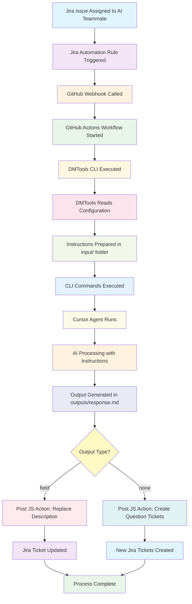

# DMTools AI Teammate

This project demonstrates how to set up an AI teammate workflow that integrates with Jira, Confluence, and other tools using GitHub Actions. The AI teammate can automate tasks, analyze issues, and provide intelligent assistance for project management workflows.

## Workflow Overview



## Overview

The AI teammate workflow uses:
- **Cursor AI Agent** for intelligent task automation
- **DMTools CLI** for integration with various platforms
- **GitHub Actions** for automated execution
- **Multiple integrations**: Jira, Confluence, Figma, and AI services

## Prerequisites

- GitHub repository with Actions enabled
- Access to Jira and Confluence instances
- API tokens for various services
- Cursor API key for AI functionality

## Setup Instructions

### 1. Repository Configuration

Clone this repository and ensure the following structure exists:
```
.github/
├── actions/
│   └── setup-java-only/
│       └── action.yml
└── workflows/
    └── ai-teammate.yml
```

### 2. Required GitHub Secrets

Configure the following secrets in your GitHub repository settings (`Settings > Secrets and variables > Actions`):

#### Authentication Secrets
| Secret Name | Description | Required |
|-------------|-------------|----------|
| `CURSOR_API_KEY` | API key for Cursor AI services | ✅ Yes |
| `JIRA_EMAIL` | Email address for Jira authentication | ✅ Yes |
| `JIRA_API_TOKEN` | API token for Jira access | ✅ Yes |
| `GEMINI_API_KEY` | Google Gemini AI API key | ✅ Yes |
| `FIGMA_TOKEN` | Figma API token for design integration | ⚠️ Optional |

### 3. Required Repository Variables

Configure the following variables in your GitHub repository settings (`Settings > Secrets and variables > Actions > Variables`):

#### Jira Configuration
| Variable Name | Description | Example |
|---------------|-------------|---------|
| `JIRA_BASE_PATH` | Base URL for your Jira instance | `https://yourcompany.atlassian.net` |
| `JIRA_AUTH_TYPE` | Authentication type for Jira | `basic` or `bearer` |

#### Confluence Configuration
| Variable Name | Description | Example |
|---------------|-------------|---------|
| `CONFLUENCE_BASE_PATH` | Base URL for Confluence | `https://yourcompany.atlassian.net/wiki` |
| `CONFLUENCE_DEFAULT_SPACE` | Default Confluence space key | `PROJ` |
| `CONFLUENCE_GRAPHQL_PATH` | GraphQL endpoint path | `https://yourcompany.atlassian.net/gateway/api/graphql` |

#### Figma Configuration (Optional)
| Variable Name | Description | Example |
|---------------|-------------|---------|
| `FIGMA_BASE_PATH` | Figma API base URL | `https://api.figma.com` |

### 4. Workflow Configuration

The workflow accepts two input parameters:

#### Required Input
- **`config_file`**: Path to the configuration file that defines the AI teammate's behavior

#### Optional Input
- **`encoded_config`**: Encoded or JSON configuration that can override or supplement the config file

## Usage

### Triggering the Workflow

#### Manual Trigger
1. **Manual Trigger**: Go to `Actions > AI Teammate > Run workflow`
2. **Provide Configuration**: 
   - Enter the path to your config file (e.g., `agents/my-config.json`)
   - Optionally provide encoded configuration data

#### Automated Trigger via Jira

You can set up Jira automation rules to automatically trigger the AI teammate workflow when specific events occur (like work item assignment). This enables seamless integration between your Jira workflow and AI assistance.

##### Setting up Jira Automation

1. **Navigate to Jira Automation**:
   - Go to your Jira project settings
   - Select "Automation" from the left sidebar
   - Click "Create rule"

2. **Configure the Trigger**:
   - **When**: Work item assigned
   - **Condition**: Assignee is AI Teammate (separate jira account needs to be created)
   - **Additional Condition**: Labels contains none of `ai_questions_asked` (to avoid duplicate triggers)

3. **Set up GitHub Token Variable**:
   - **Then**: Create variable
   - **Variable name**: `githubToken`
   - **Smart value**: Your GitHub personal access token with `repo` and `actions:write` permissions

4. **Configure Webhook Actions**:

   **First Action - Story Description Analysis**:
   - **Then**: Send web request
   - **Method**: POST
   - **URL**: `https://api.github.com/repos/YOUR_ORG/YOUR_REPO/actions/workflows/ai-teammate.yml/dispatches`
     
     ⚠️ **Important**: Replace `YOUR_ORG/YOUR_REPO` with your actual GitHub organization and repository name
   
   - **Headers**:
     ```
     Accept: application/vnd.github.v3+json
     Authorization: token {{githubToken}}
     ```
   
   - **Body**:
     ```json
     {
       "ref": "main",
       "inputs": {
         "config_file": "agents/story_description.json", 
         "encoded_config": "{{#urlEncode}}{
       \"params\": {
         \"inputJql\": \"key = {{issue.key}}\",
         \"initiator\": \"{{initiator.name}}\"
       }
     }{{/urlEncode}}"
       }
     }
     ```

   **Second Action - Story Questions Analysis**:
   - **Then**: Send web request
   - **Method**: POST
   - **URL**: `https://api.github.com/repos/YOUR_ORG/YOUR_REPO/actions/workflows/ai-teammate.yml/dispatches`
   
   - **Headers**:
     ```
     Accept: application/vnd.github.v3+json
     Authorization: token {{githubToken}}
     ```
   
   - **Body**:
     ```json
     {
       "ref": "main",
       "inputs": {
         "config_file": "agents/story_questions.json", 
         "encoded_config": "{{#urlEncode}}{
       \"params\": {
         \"inputJql\": \"key = {{issue.key}}\",
         \"initiator\": \"{{initiator.name}}\"
       }
     }{{/urlEncode}}"
       }
     }
     ```

##### Required Configuration Files

The workflow uses two main configuration files that define the AI teammate's behavior:

**[`agents/story_description.json`](agents/story_description.json)** - For analyzing and improving story descriptions:
- **Role**: Experienced Business Analyst
- **Purpose**: Analyzes Jira story descriptions and suggests improvements
- **Output**: Replaces the ticket description field directly
- **Key Features**: Preserves attachments, handles Figma designs, checks child tickets for context

**[`agents/story_questions.json`](agents/story_questions.json)** - For generating clarifying questions:
- **Role**: Experienced Business Analyst  
- **Purpose**: Generates clarifying questions as structured JSON output
- **Output**: Creates new Jira tickets for each question
- **Key Features**: Avoids duplicate questions, supports priority levels, investigates codebase context

##### GitHub Personal Access Token Setup

1. **Create GitHub Token**:
   - Go to GitHub Settings > Developer settings > Personal access tokens
   - Generate new token (classic)
   - Select scopes: `repo`, `workflow`
   - Copy the generated token

2. **Store Token in Jira**:
   - Use the token as the value for the `{{githubToken}}` smart value in your automation rule
   - Consider using Jira's secure variable storage for sensitive tokens

##### Automation Flow

When properly configured, the automation will:

1. **Trigger**: When a work item is assigned to "AI Teammate"
2. **Check**: Ensure the issue doesn't have the `ai_questions_asked` label
3. **Execute**: 
   - First webhook analyzes the story description
   - Second webhook generates clarifying questions
4. **Result**: AI teammate processes the Jira issue and provides intelligent assistance

### Configuration File Structure

Based on the example configurations in this repository, here are the common configuration keys:

| Key | Type | Description | Example |
|-----|------|-------------|---------|
| `name` | string | Name of the AI teammate agent | `"Teammate"` |
| `params` | object | Main configuration parameters container | `{}` |
| `params.agentParams` | object | AI agent specific parameters | `{}` |
| `params.agentParams.aiRole` | string | Role definition for the AI agent | `"Experienced Business Analyst"` |
| `params.agentParams.instructions` | array | List of instructions and template URLs | `["https://dmtools.atlassian.net/wiki/..."]` |
| `params.agentParams.knownInfo` | string | Additional context information | `""` |
| `params.agentParams.formattingRules` | string | URL or text defining output formatting | `"https://dmtools.atlassian.net/wiki/..."` |
| `params.agentParams.fewShots` | string | Example outputs for the AI agent | `"[{\"summary\": \"...\"}]"` |
| `params.cliCommands` | array | Commands to execute the agent | `["./cicd/scripts/run-cursor-agent.sh ..."]` |
| `params.outputType` | string | How to handle the output | `"field"` or `"none"` |
| `params.fieldName` | string | Target Jira field name (when outputType is "field") | `"Description"` |
| `params.operationType` | string | How to modify the field | `"Replace"` |
| `params.ticketContextDepth` | number | Depth of ticket context to include | `0` |
| `params.attachResponseAsFile` | boolean | Whether to attach response as file | `false` |
| `params.skipAIProcessing` | boolean | Skip additional AI processing | `true` |
| `params.inputJql` | string | JQL query to find target tickets | `"key = TICKET-XXX"` |
| `params.initiator` | string | User ID who initiated the action | `"712020:..."` |
| `params.postJSAction` | string | JavaScript file to run after processing | `"agents/assignForReview.js"` |

### Configuration Examples

See the actual working configurations in this repository:
- **Story Description**: [`agents/story_description.json`](agents/story_description.json)
- **Story Questions**: [`agents/story_questions.json`](agents/story_questions.json)

## Supported Integrations

The workflow supports the following integrations through DMTools:

- **Jira**: Issue tracking, project management, automated updates
- **Confluence**: Documentation, knowledge base integration
- **Figma**: Design file analysis and integration
- **AI Services**: Intelligent task automation and analysis

## Workflow Features

### Automatic Setup
- Java environment configuration
- Cursor CLI installation and setup
- DMTools CLI installation from latest release
- Environment variable configuration

### Security
- Secure handling of API tokens and credentials
- Proper permissions for repository and pull request access
- Environment variable isolation

### Monitoring
- Comprehensive logging and error reporting
- Version checking for installed tools
- Path verification and debugging

## Troubleshooting

### Common Issues

1. **Missing API Keys**: Ensure all required secrets are configured in repository settings
2. **Invalid Configuration**: Verify your config file syntax and paths
3. **Permission Errors**: Check that the workflow has necessary permissions for your repositories

### Debug Information

The workflow includes extensive debugging output to help identify issues:
- Installation verification for Cursor CLI
- Path configuration details
- Environment variable validation

## Contributing

1. Fork the repository
2. Create a feature branch
3. Make your changes
4. Test with your own Jira/Confluence setup
5. Submit a pull request

## License

This project is licensed under the MIT License - see the [LICENSE](LICENSE) file for details.

## Support

For issues related to:
- **DMTools**: Visit the [DMTools repository](https://github.com/IstiN/dmtools)
- **Cursor AI**: Check Cursor documentation
- **This workflow**: Open an issue in this repository
